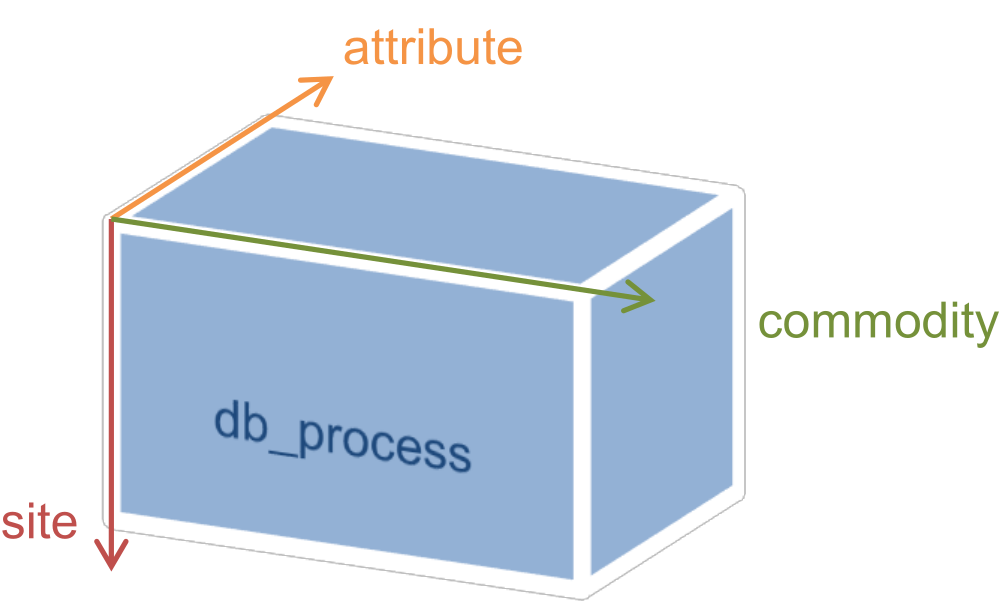

GAMS introduction
=================

GAMS, short for *General Algebraic Modelling System*, is a commercial
optimization software developed and sold by GAMS Development
Corporation. Its speciality is describing and solving large-scale
optimization problems with millions of variables and equations. It
comprises a special purpose model description language based on *sets*,
*parameters*, *variables* and *equations*. It supports solving linear,
mixed integer, quadratic and nonlinear optimization problems.

Sets and parameters are input data that describe the system to be
optimized. Equations describe the system structure. Variables values of
an optimal solution are model output.

Example (1) – Fuel station
--------------------------

The following code section is a complete model of a hypothetic fuel
station for electric vehicles that generates its electricity from
renewable sources and has an electric storage. Highlighted are
non-functional inline comments that provide explanations and data
sections.

**Sets** (input) in this model are electricity generation technologies i
(photovoltaics, wind onshore and offshore) and timesteps t (1…8760).
Each renewable source has a normalised timeseries **parameter** cf(t,i)
that is defined over the whole year with time resolution of one hour.
Electric cars are modelled as a demand timeseries d(t). For brevity, all
timeseries are generated from random numbers. Both storage and
electricity generation have attached investment costs cs in k€ per MWh
storage capacity and c(i) in k€ per MW generation capacity.

Optimization **variables** (model output) in this model are the
generation capacities per technology x(i) in MW and the storage size s
in MWh. The variable to be minimized is z, the total cost for satisfying
the demand d(t) in each timestep over the whole year. Variable st(t)
simulates the storage filling level in each timestep. All energy
quantities are limited to positive values by a single positive
statement.

The main **equation** cost sets the value for variable z. It is the cost
function, whose value z is to be minimized. Equation pp(t) calculates
the value for helper variable tp(t), the total energy production per
timestep. Equation dd(t) assures demand satisfaction either from
production or storage and is the main optimization constraint in this
model. Equation storage(t) calculates the filling levels for each
timestep. Variable sell(t) enables the model to throw away excess
energy. Equation ss(t) limits filling level to the storage capacity. The
final equations ss0(tfirst) and ssN(tlast) set boundary conditions for
the storage filling level.

::

    $title Electric fuel station model (fuelstation.gms)
    
    Sets
        t          time               / 1*8760 /
        i          type of production / pv, windon, windoff /
        tfirst(t)  first timestep
        tlast(t)   last timestep;
    
        tfirst(t) = yes$(ord(t) eq 1);
        tlast(t)  = yes$(ord(t) eq card(t));
    
    Parameters
        cs      cost of storage tank (k€ per MWh) / 100 /
        c(i)    cost of plant (k€ per MW) / pv 3000, windon 1500, windoff 2500 /
        d(t)    demand (MWh)
        cf(t,i) relative (normalized to 1) production of plants;
    
        d(t) = uniform(0,1);
        cf(t,'pv') = min(max(0,power(sin(ord(t)/24*3.14/2),4)+normal(.1,.1)),1);
        cf(t,'windon') = min(max(0,uniform(0,1)),1);
        cf(t,'windoff')= min(max(0,sqrt(sqrt(uniform(0,1)))),1);
    
    Variables
        x(i)       size of production facilities (MW)
        s          size of accumulator (MWh)
        st(t)      evolution of accumulator SOC (MWh)
        tp(t)      total production of plants per timestep (MWh)
        z          total cost (k€)
        sell(t);
    
    Positive Variables x, s, st, sell;
    
    Equations
        cost       total cost equation
        pp(t)      calculates tp (total production) from cf and x
        dd(t)      assures that demand is always satisfied
        storage(t) new_storage = storage + input - demand
        ss(t)      simulates the capacity of the accumulator
        ss0(t)     initial storage content
        ssN(t)     final storage content;
    
        cost..         z          =e= sum(i, x(i)*c(i)) + cs*s;
        pp(t)..        tp(t)      =e= sum(i, cf(t,i)*x(i));
        dd(t)..        d(t)       =l= tp(t) + st(t);
        storage(t)..   st(t+1)    =e= st(t) + tp(t) - d(t) - sell(t);
        ss(t)..        st(t)      =l= s;
        ss0(tfirst)..  st(tfirst) =g= s/2;
        ssN(tlast)..   st(tlast)  =g= s/2;
    
    Model  fuelstation / all / ;
    Solve  fuelstation using lp minimizing z ;
    Display  x.l, s.l;

Sets
----

Sets are collections of items. Each item is identified by its string
representation, a string which can be up to 63 characters long and must
start with an alphabetic or numeric character. In unquoted strings, the
only allowed characters are alphabetic and numeric characters, plus (+),
minus (-) and the underscore (\_). In quoted strings spaces and special
characters are allowed. Set elements are separated by commas or line
breaks. Example:

::
    
    set supply sites / Seattle, Chicago, "New York", Washington /;

Numeric items in general have no special meaning or semantics. There is,
however, syntactic sugar to automate creating sets with numeric
elements. The following example creates a set with 168 consecutive
integer elements 1 to 168:

::
    
    set t timesteps / 1\*168 /;

Subsets can be created by naming the superset in parenthesis after the
set name. Elements of the subsets then need to be elements of the
superset. Subsets used for special rules that only apply to a subgroup
of modelled things.

::
    
    set bigsupply(supply) special sites / Seattle, Washington /;

Elements for sets can not only be explicitly named, but also computed.
This happens usually for subsets of a static superset. The syntax is
subset(superset) = yes$condition. The command includes those items of
the superset in the subset that fulfil the condition. Conditions are
comparison expressions that can include sets, parameters and functions
(described in section 1.6). The following example creates the subset
tlast by only including the last element of t by using the set functions
ord and card that exploit implicit ordering of static sets like t
(called *ordered set*):

::
    
    set t timesteps / 1\*8760 /;
    set tfirst(t) initial timestep;
    tlast(t) = yes$(ord(t) eq card(t));

Multi-dimensional sets can be defined like subsets, but with multiple
supersets. Elements are defined by a concatenation of set elements with
the dot (.) character:

::
    
    set co commodities / Coal, Gas, Oil /;
    set pro process names / gt, pp, cc /;
    set process_chain(co,pro) / Coal.pp, Coal.cc, Gas.gt, Oil.pp /;

It is possible to assign an alias to any set. This can be useful either
for having a shorter name and is necessary for defining certain types of
equations.

::
    
    alias(knownset,alias1,alias2,…);
    alias(node,i,j);

Parameters
----------

Parameters are n-dimensional matrices of numerical values, defined over
one or several sets, the so-called onsets. Scalar parameters without
onsets are possible, too. Like with sets, an explanatory text can be
added between parameter name (loss) and data section (/…/):

::
    
    parameter loss energy losses per km / 0.001 /;

Here is a typical example for a one-dimensional parameter:

::
    
    set tech / pv, windon, windoff, hydro /;
    parameter invcost(tech) investment cost per kW
             / pv 2000, windoff 1500, windon 1100, hydro 900 /;

A more advanced example for a two-dimensional parameter that mixes
explicit values and computed values to create a symmetric distance
matrix among a set of nodes. Unmentioned set element pairs automatically
have the value zero:

::
    
    set node / a, b, c, d /;
    parameter dist(node, node) / a.b 5, b.c 7, c.d 5 /;
    alias(node,i,j);
    dist(j,i)$(dist(i,j)) = dist(i,j);

There is another format for entering data for dense, high-dimensional
data: the table command. Usually, the nth dimension is used as captions
for columns, while the remaining (n-1) dimensions are used as row
captions. The following example shows a typical three-dimensional
parameter definition:

::
    
    set site / AT, CH, DE /;
    set commodity / Gas, Wind /;
    set attribute / invcost, instcap /;
    table db_process(site,commodity,attribute)
                    invcost       instcap
         AT.Gas         800           470
         AT.Wind       1600          2400
         CH.Gas         750           650
         CH.Wind       1900          5500
         DE.Gas         850         35000
         DE.Wind       1400         23000;

The resulting data structure can be visualised as a cube/array with
three dimensions. Each direction corresponds to one of the onsets:

Variables
---------

Variables are declared like parameters, except that their value is not
pre-defined. It is the solver’s task to find values for all variables
that minimize or maximize the objective function. Equations can limit
the allowed value range or even force some variables to a fixed value.

::
    
    variable z total cost;
    variable p(tech) output power (kW) per plant;
    variable x(tech) building decision per plant;

By default, variables are unconstrained real values. Additional
statements allow restricting the allowed range to positive, binary or
integer values:

::
    
    positive variable p;
    binary variable x;

After a successful optimization run, the following attributes of each
variable are set:

+-------------+------------------------------------------------------------------------+
| Attribute   | Explanation                                                            |
+=============+========================================================================+
| .l          | Activity level. Value of variable in optimal solution.                 |
+-------------+------------------------------------------------------------------------+
| .m          | Marginal. Change in cost function value if x is changed by one unit.   |
+-------------+------------------------------------------------------------------------+

Equations
---------

Equations are the core of every GAMS model. They describe the
connections between parameters and variables. Sets provide means to
restrict equations to certain groups of elements. It is beyond the scope
of this document to explain their syntax. GAMS provides more than enough
examples and documentation. Section 1.7 lists the most important
documents.

Auxiliary statements
--------------------

Apart from the aforementioned elements, there are a number of other
language features that allow for easier data handling, debugging and
result display. The following table summarises frequently used
statements.

+-----------+------------------------------------------------------------------------------+
| Command   | Explanation                                                                  |
+===========+==============================================================================+
| display   | Displays contents of sets, parameters or variables after successful solve.   |
+-----------+------------------------------------------------------------------------------+
| solve     | Solves a problem created by the command model.                               |
+-----------+------------------------------------------------------------------------------+
| model     | Creates a problem from a set of equations. all uses to all equations.        |
+-----------+------------------------------------------------------------------------------+

For example, to display the optimal value of decision variable x after
simulation, the command display x.l; can be used.

Further reading
---------------

A good introductory document with all common language features is the
**GAMS Users Guide**:

    C:\\GAMS\\win64\\xx.y\\docs\\userguides\\GAMSUsersGuide.pdf

A more in-depth language reference is the extended **McCarl GAMS User
Guide**:

    C:\\GAMS\\win64\\xx.y\\docs\\userguides\\mccarl\\mccarlgamsuserguide.pdf

A third source of inspiration is the **GAMS Model Library** that can be
found in the GAMS main menu.
