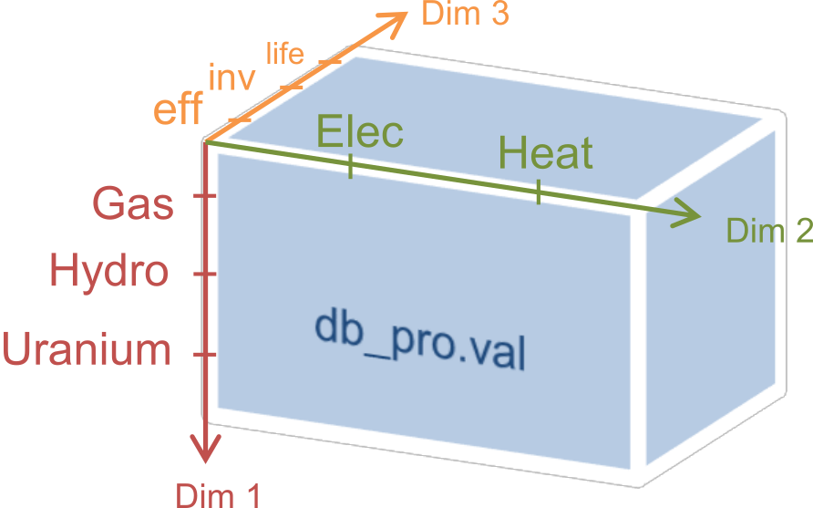
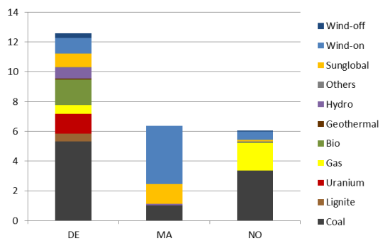

.. highlight:: matlab

GAMS.m
======

``GAMS.m`` is a utility class for MATLAB that allows creating input data for
GAMS models, reading and writing input and result data from and to GAMS
models and finally executing those models. Advanced functions allow
manipulating data, especially for plotting and reporting functions.

The following table lists the most important functions, grouped by type:

+---------------------+--------------------+----------------------------------------------+------------+
| Group               | Function           | Explanation                                  | cf.        |
+=====================+====================+==============================================+============+
| Data creation       | ``GAMS.set``       | Create a set                                 | 2.3        |
+---------------------+--------------------+----------------------------------------------+------------+
|                     | ``GAMS.param``     | Create a parameter                           | 2.4        |
+---------------------+--------------------+----------------------------------------------+------------+
| GDX read/write      | ``GAMS.getGDX``    | Read 1 set, param, var, eq from GDX file     | 2.5        |
+---------------------+--------------------+----------------------------------------------+------------+
|                     | ``GAMS.putGDX``    | Write N sets, params to GDX file             | 2.5        |
+---------------------+--------------------+----------------------------------------------+------------+
| XLS read/write      | ``GAMS.getXLS``    | Read 1 entity or timeseries from XLS table   | 2.8, 2.9   |
+---------------------+--------------------+----------------------------------------------+------------+
|                     | ``GAMS.putXLS``    | Write N sets, params to XLS file             | 2.10.2     |
+---------------------+--------------------+----------------------------------------------+------------+
| Data manipulation   | ``GAMS.rectify``   | Make a set/param conform to desired uels     | 2.10.1     |
+---------------------+--------------------+----------------------------------------------+------------+
|                     | ``GAMS.sum``       | Sum a param/var over multiple dimensions     | 2.10.2     |
+---------------------+--------------------+----------------------------------------------+------------+
|                     | ``GAMS.merge``     | Create union of two sets/params/variables    | 2.10.3     |
+---------------------+--------------------+----------------------------------------------+------------+
| Calling GAMS        | ``g.run``          | Call gams.exe and retrieve solver status     | 2.6        |
+---------------------+--------------------+----------------------------------------------+------------+

Motivation
----------

The way of providing data to a model directly in its source code makes
it easy to create a new model fast, but makes it difficult to change
parameter values. The easiest way to overcome this limitation is to use
the ``$include`` command in a parameter's data section:

.. code-block:: gams
    
    set tech /
    $include "data/set_tech.txt"
    /
    parameter invcost(tech) /
    $include "data/param_invcost.txt"
    /

The text file *param\_invcost.txt* then could contain the following lines,
where each entry must be a member of the set ``tech``:

.. code-block:: gams
    
    pv = 2000
    wind = 1500
    hydro = 900

While it is easy to automatically create a few of those files for simple
models, this way of data handling becomes hard to maintain for big
models. That is why GAMS also provides functions of retrieving data from
specially prepared Excel files or even through database queries, but all
those solutions lack a proper way to return huge amounts of result data
in a flexible way. The following way scales better and can handle result
data the same way as input data:

Model data can be also provided in the form of the binary GDX (GAMS data
exchange) format. The changes for any given GAMS model are minor. For
each set and parameter declaration a corresponding $load statement must
be included in the GAMS model file, as shown in the following GAMS code
example. 

**Before:** with inline data
    
.. code-block::                                 
                                   
    set source / a, b, c /;        
    set sink / x, y, z /;          
    parameter dist(source, sink)   
    / a.x 71, […], c.z 43 /;       
                                   
**After:** with GDX file input

.. code-block::

    $gdxin input_file.gdx
    set source;
    set sink;
    $load source sink
    parameter dist(source, sink);
    $load dist

Of course, the question arises how to create those binary data files.
GAMS offers several facilities and tools [1]_ to work with GDX files.
One user contributed solution is GDXMRW [2]_ (GDX MATLAB Read and
Write), a collection of binary functions for MATLAB. They give
read/write access to GDX files in form of MATLAB functions (rgdx, wgdx).
``GAMS.m`` is a wrapper class built around these two functions. It not only
allows GDX file reading/writing, but also creating and manipulating
these data structures through utility functions.

Example (2) – GAMS with MATLAB script
-------------------------------------

This change is shown exemplarily for the fuel station example from
section 1.1. First the necessary changes in the model file are shown.
While set and parameter declarations remain unchanged, the data sections
are replaced by $load statements. The variable and equation parts are
not shown as they are not affected by the change.

.. code-block::
    
    $title Electric fuel station model (fuelstation.gms)
    
    $gdxin input.gdx
    Sets     t          time
             i          type of production;
    $load    t i
    
    Sets     tfirst(t)  first timestep
             tlast(t)   last timestep;
    
             tfirst(t) = yes$(ord(t) eq 1);
             tlast(t)  = yes$(ord(t) eq card(t));
    
    Parameters
             cs         cost of storage tank (k€ per MWh)
             c(i)       cost of plant (k€ per MW)
             d(t)       demand (MWh)
             cf(t,i)    relative (normalized to 1) production of plants;
    $load    cs c cf d=demand

The following MATLAB script interacts with this model file by creating
all input data and writing it to the input data file input.gdx. After
calling the solver (and waiting for the process to terminate), the
solver’s return code is checked for success. In that case, variable x(i)
is read from the result file result.gdx. Highlighted are the data
sections and lines with data transfer between MATLAB and GAMS.

::
    
    % fuelstation.m
    % sets
    t      = GAMS.set('t', 1:8760);
    i      = GAMS.set('i', {'pv', 'windon', 'windoff'});
    
    % parameters
    cs     = GAMS.param('cs',100); % cost of storage (€/MWh)
    c      = GAMS.param('c',[3000 1500 2500],i.uels); % cost of plant (€/MWh)
    demand = GAMS.param('demand',rand(8760,1),t.uels);
    
    % renewable timeseries
    values = [ ... 
        min(max(0, sin((1:8760)'/24*3.14/2).^4+0.15*randn(8760,1)), 1), ...
        min(max(0, rand(8760,1)), 1), ...
        min(max(0, rand(8760,1).^0.25), 1) ];
    onset = { t.uels i.uels };
    cf = GAMS.param('cf', values, onset);
    clear values onset;
    
    % write to GDX file
    GAMS.putGDX('input.gdx',t,i,c,cs,demand,cf);
    
    % run GAMS model
    g = GAMS(struct('model','fuelstation.gms'));
    g.run; % executes "gams.exe fuelstation.gms –GDX=result.gdx"
    
    % read result variable x if run successful
    if g.status == 0
        x = GAMS.getGDX('result.gdx','x');
        x = GAMS.rectify(x, i.uels);
    
        bar(1000*x.val);
        set(gca,'XTickLabel',x.uels{1});
        ylabel('Installed capacity (kW)');
    end

The following paragraphs explain now how each of the GAMS functions used
in this example work, in the order of appearance in this example.

Input data – Sets
-----------------

In order to create a GAMS set in MATLAB, all that is needed is a list of
the desired set elements as a cell array of strings:

::
    
    elements = {'a' 'b' 'c'};
    A = GAMS.set('A', elements);

Function ``GAMS.set`` takes two arguments. The first is the name of the set
as it is used in the GMS model file. The second is a cell array of the
set elements. The resulting variable A is a structure with the following
fields:

::
    
    A = 
        name: 'A'
        type: 'set'
        val:  [1 1 1]
        form: 'full'
        dim:  1
        uels: {{'a' 'b' 'c'}}
        ids: {struct('a',1,'b',2,'c',3)}

+-------------+-----------------------------------------------------------------------------+
| Field       | Explanation                                                                 |
+=============+=============================================================================+
| ``name``    | Name of the set                                                             |
+-------------+-----------------------------------------------------------------------------+
| ``type``    | 'set'                                                                       |
+-------------+-----------------------------------------------------------------------------+
| ``val``     | Incidence value matrix, 1 indicates a set element, 0 none                   |
+-------------+-----------------------------------------------------------------------------+
| ``form``    | 'full' or 'sparse'. Indicates size and interpretation of the value matrix   |
+-------------+-----------------------------------------------------------------------------+
| ``dim``     | Number of dimensions in value matrix and uels                               |
+-------------+-----------------------------------------------------------------------------+
| ``uels``    | Value labels with one cell array per dimension                              |
+-------------+-----------------------------------------------------------------------------+
| ``ids``     | Lookup table structures with uels as fieldnames                             |
+-------------+-----------------------------------------------------------------------------+

For comfort, also numeric matrices can be given as set elements. They
are then automatically converted to strings, as required for uels by
GAMS:

::
    
    t = GAMS.set('t',1:3)

Multi-dimensional sets can be declared by providing a cell array of cell
arrays, where each inner cell array corresponds to one element tuple of
the desired set. For domain checking, allowed elements must be given as
a third argument, again as a cell array of cell arrays, one per
dimension:

::

    elements = {{'a' '1'} {'b' '3'} {'c' '2'}};
    onsets = [A.uels t.uels];
    At = GAMS.set('At', elements, onsets)

As can be seen, specifying huge amounts of data directly in MATLAB code
can be more verbose than in GAMS.

Input data – Parameters
-----------------------

In order to create a parameter, two things are needed: a matrix/array of
values and a cell array of the same size, indicating the set elements
over which these values are defined, called onset. Only in the simplest
case of a scalar parameter, the onset can be left out:

::
    
    cpd = GAMS.param('cost_per_dist', 29.95)

Like ``GAMS.set``, the first function argument of ``GAMS.param`` specifies the 
ame of the parameter that will be visible for GAMS. Here is an example for a
typical, one-dimensional parameter:

::
    
    sites = {'AT' 'CH' 'DE'};
    vals = [8.4 7.6 82.1] * 1e6;
    pop = GAMS.param('pop_per_country', vals, {sites})

Here sites is a list of countries and vals is a vector of population
statistics. The curly braces around {sites} in the function call packs
the site list into a single cell array, corresponding to the one
dimension of vals. If this does not make sense to you, compare it to the
following two-dimensional example:

::
    
    sites = {'AT' 'CH' 'DE'};
    coin  = {'Coal' 'Hydro' 'Wind'};
    vals  = [  1.3     6.6    3.0 ; ... AT
               0.0    11.0    0.5 ; ... CH
              30.0     0.9   70.0   ... DE
            ];
    ppc   = GAMS.param('pp_capacity', vals, {sites coin})

The value matrix now contains power plant capacities per country and
input commodity. Dimension one (rows) corresponds to countries,
dimension two (columns) to input commodities. The onset cell array
{sites coin} now has length two, matching the two dimensions of vals.

For more than two dimensions, the following structure of providing
values and onsets has proven least complicated: the value matrix stays
two-dimensional. Each row corresponds to a tuple of (n-1) dimensions;
the nth dimension is addressed by the columns of the value matrix. The
following example demonstrates this usage:

::
    
    pros = {{'Hydro' 'Elec'} {'Gas' 'Heat'} {'Uranium' 'Elec'}};
    atts = {'efficiency' 'inv-cost' 'life-time'};
    vals = [       0.40        900         100 ; ... Hydro.Elec
                   0.80        650          30 ; ... Gas.Heat
                   0.35       1800          25   ... Uranium.Elec
           ];
    db_pro = GAMS.param('db_pro',vals,{pros atts})

Function ``GAMS.param`` returns a MATLAB struct with the following fields:

+-----------+-----------------------------------------------------------------------------+
| Field     | Explanation                                                                 |
+===========+=============================================================================+
| ``name``  | Name of the parameter                                                       |
+-----------+-----------------------------------------------------------------------------+
| ``type``  | 'parameter'                                                                 |
+-----------+-----------------------------------------------------------------------------+
| ``val``   | Value matrix as numerical array                                             |
+-----------+-----------------------------------------------------------------------------+
| ``form``  | 'full' or 'sparse'. Indicates size and interpretation of the value matrix   |
+-----------+-----------------------------------------------------------------------------+
| ``dim``   | Number of dimensions in value matrix and uels                               |
+-----------+-----------------------------------------------------------------------------+
| ``uels``  | Value labels with one cell array per dimension                              |
+-----------+-----------------------------------------------------------------------------+
| ``ids``   | Lookup table structures with uels as fieldnames                             |
+-----------+-----------------------------------------------------------------------------+

The numerical array val can be visualised like an n-dimensional array of
values, here shown for the previous example:

In order to identify and address the values in the value array val, the
interpretation for a given position (uels) and position for a given
meaning (ids) are added to the data structure. In the previous code
example, they would look like this:

::
    
    db_pro.uels = { ...
         {'Gas'	'Hydro' 'Uranium'} ...
         {'Elec' 'Heat'} ...
         {'efficiency' 'inv-cost' 'life-time'} };

For each dimension, the position in the value matrix field val
corresponds to a combination of labels in uels. This can be used for
example in a plot of process efficiencies:

::
    
    bar(db_pro.val(:,:,1));
    set(gca,'XTickLabel',db_pro.uels{1});
    legend(db_pro.uels{2});

Note the hardcoded number 1 in the first line, denoting the position of
the field efficiency in the value matrix. However, this number might
change any time when new attributes are added to the list of attributes
atts. This is where ids are handy. They provide lookup tables in form of
MATLAB structs that map labels to their position in the value table. In
the example above, ids would look like this:

::
    
    db_pro.ids = { ...
        struct('Gas',1,'Hydro',2, 'Uranium',3) ...
        struct('Elec',1,'Heat',2) ...
        struct('efficiency',1,'inv_cost',2,'life_time',3) };

Note that dashes (-) in uels are replaced by underscores (\_) in ids
because MATLAB does not allow them as structure fieldnames. With using
ids, the bar plot from above could be written as follows:

::
    
    bar(db_pro.val(:,:,db_pro.ids{3}.efficiency));

If using more than one id of a structure, it has proven efficient to
temporarily store them in a variable with a short name, like here:

::
    
	pids = db_pro.ids;
	bar(db_pro.val(:,:,pids{3}.efficiency));

GDX data exchange
-----------------

Writing GDX files
~~~~~~~~~~~~~~~~~

The previous sections have shown how to create sets and parameters for
GAMS models. Now it is explained how these data structures can be
written to and read from GDX files. The next code block creates some
sets and one parameter that shall be written to an input file:

::
    
    timeSpan = 4000:6000;
    t = GAMS.set('t', timeSpan);
    tm = GAMS.set('tm', timeSpan(2:end));
    dem = GAMS.param('demand', rand(size(tm.val)), tm.uels);

The resulting sets and parameter now can be written to a GDX file using
function putGDX:

::
    
    GAMS.putGDX('input.gdx',t,tm,dem)

The first argument to this function is the filename to a GDX file. If it
exists, its contents are overwritten. So it is not possible to add
elements to a GDX file with successive calls. After the file name, the
function takes an arbitrary number of arguments that must be either sets
or parameters.

Reading GDX files
~~~~~~~~~~~~~~~~~

After a successful simulation run it is usually necessary to find out
something about the variable values and equation levels. This is done by
reading variable values from a result GDX file the following way:

::
    
    eprout = GAMS.getGDX('result.gdx','EprOut')

The first argument gives the GDX filename to be read from and argument
two is the name of the symbol to be read. It can be a set, parameter,
variable or equation. An optional third argument specifies whether a
full or sparse value matrix should be returned:

::
    
    fin = GAMS.getGDX('result.gdx','fin','sparse')

Variables and equations do not only have a value, but also a marginal
value. It can be read from the GDX file using the optional fourth
argument that specifies the field to be read:

::
    
    some_constraint = GAMS.getGDX('result.gdx', 'some_constraint', '', 'm')

Variables are identical in structure to parameters. They even can be
used as such, if their type is changed to parameter manually:

::
    
	eprout = GAMS.getGDX('result.gdx','EprOut')
	eprout.type = 'parameter'
	GAMS.putGDX('input.gdx',eprout)

Calling GAMS
------------

In order to call GAMS from MATLAB, a GAMS object has to be created. This
can be done using the following MATLAB command:

::
    
    g = GAMS

This initialises variable g with a property g.path to default values,
which are shown in the following table.

+--------------------+-------------------------+--------------------+
| Field name         | Default value           | Comment            |
+====================+=========================+====================+
| ``gams``           | ``gams.exe``            | GAMS executable    |
+--------------------+-------------------------+--------------------+
| ``model``          | ``model.gms``           | GAMS model file    |
+--------------------+-------------------------+--------------------+
| ``result``         | ``result.gdx``          | GAMS result file   |
+--------------------+-------------------------+--------------------+

If your GAMS executable is not in the system path [3]_, you can provide
the absolute path directly:

::
    
    g = GAMS(struct('gams','C:/GAMS/gams.exe'))

The following example shows how to specify a different model filename
and result file:

::
    
    g = GAMS(struct('model','fuelstation.gms','result','out.gdx'))

Once the object is set up, GAMS can be run by simply typing:

::
    
    g.run

This launches the system command "gams.exe model.gms -GDX=result.gdx",
while all paths are replaced according to the fields in g.path. The
option -GDX=result.gdx saves all model data (including input data) to
the specified GDX filename. For later backup of a simulation run it is
sufficient to save this file alone.

The return code of the system command is retrieved and stored in the
object property g.status. A value of zero (as in "zero errors")
indicates a successful run; a non-zero value corresponds to any kind of
error. In that case, the run log file model.lst provides error messages
marked by four stars \*\*\*\* that can be used to debug.

The advantages of such the GAMS object will become clearer when
inheriting from the GAMS class to create a model-specific interface
class. It then can automate the steps that are done in the MATLAB script
of the fuel station example from section 3.2. This is demonstrated in
the following section.

Example (3) – Interface class replaces script
---------------------------------------------

The example from section 3.2 is already an improvement compared to the
pure GAMS code from section 1, but repetitive actions like writing input
data, calling GAMS and reading results could be further automated. This
is best done by creating a class. It creates an object that holds the
status (input and output data) of the model. The following code block is
to be put in a file called FS.m anywhere in the MATLAB path:

::
    
    classdef FS < GAMS
        properties
            % input data
            set_t      % timesteps
            set_i      % technologies
            db_cs      % cost of storage (€/MWh)
            db_c       % cost of plant (€/MWh)
            ts_demand  % demand timeseries (1)
            ts_cf      % renewable input timeseries (1)
            
            % result data
            Z       % total cost (k€)
            X       % plant sizes per technology (MW)
            S       % storage size (MWh)
        end
        
        methods
            function obj = FS()
                % Call GAMS constructor
                obj = obj@GAMS((struct('model','fuelstation.gms')));
                
                % Set values for input data
                obj.set_t = GAMS.set('t', 1:8760);
                obj.set_i = GAMS.set('i', {'pv', 'windon', 'windoff'});
                
                obj.db_cs     = GAMS.param('cs',100); 
                obj.db_c      = GAMS.param('c',[3000 1500 2500],obj.set_i.uels); 
                obj.ts_demand = GAMS.param('demand',rand(8760,1),obj.set_t.uels);
                
                values = [ ... 
                    min(max(0, sin((1:8760)'/24*3.14/2).^4+0.15*randn(8760,1)), 1), ...
                    min(max(0, rand(8760,1)), 1), ...
                    min(max(0, rand(8760,1).^0.25), 1) ];
                onset = [ obj.set_t.uels obj.set_i.uels ];
                obj.ts_cf = GAMS.param('cf', values, onset);
            end
            
            function writeInputs(obj)
                GAMS.putGDX('input.gdx', obj.set_t, obj.set_i, ...
                    obj.db_cs, obj.db_c, obj.ts_demand, obj.ts_cf);
            end
            
            function readResults(obj)
                obj.Z = GAMS.getGDX(obj.path.result, 'z');
                obj.X = GAMS.getGDX(obj.path.result, 'x');
                obj.S = GAMS.getGDX(obj.path.result, 's');
                
                obj.X = GAMS.rectify(obj.X, obj.set_i.uels);
            end
            
            function plot(obj)
                bar(1000*obj.X.val);
                set(gca,'XTickLabel',obj.X.uels{1});
                ylabel('Installed capacity (kW)');
                grid on;
            end
        end
    end

This file contains the class FS (short for fuel station). It has several
properties that contain the input and output data of the original fuel
station model. In the section methods, three functions are defined. The
first, FS, is the constructor. It sets all values of input data
properties. The function writeInputs handles writing input data to a GDX
file. Function readResults handles output data reading and already shows
an advanced feature (rectify, described in section 0) for normalising
GAMS data structures.

While this change increases the amount of code and complexity for a
small model, the scalability for bigger models is much better. Hundreds
of little actions can be automatically performed before, during and
after the simulation just by modifying the appropriate functions in a
single class file, while scripts remain short code snippets with
high-level statements that can be used for scenario generation and
custom analysis. This is how the new script fuelstation.m looks like
when using the interface class FS:

::
    
    % fuelstation.m using interface class FS
    f = FS;
    f.writeInputs;
    f.run;
    
    % read result and plot variable x if run successful
    if f.status == 0
        f.readResults;
        f.plot;
    end

Note that function ``run`` and property ``status`` are not defined in ``FS.m``, 
but *inherited* from ``GAMS.m``.

The next logical step in continuing to develop FS.m could be to
establish a mechanism to read the initial input data form somewhere
else, e.g. a database, an Excel file (see the next two sections for
that), a webpage URL… Anything that can be done using MATLAB code can
now be part of the model data preparation.

Input data – Entities
---------------------

The problem with independent definitions of sets and parameters is that
one has to manually keep track that parameter values and set elements
match. Wouldn't it be nicer to only type in sets and parameter value
only once? This is what the entity data format is for. It offers the
possibility to enter data in the following format to quickly generate
several sets and parameters in one place:

+--------+-----------+---------+--------+------------+------------+----------+
| Site   | Coin      | Coout   | eff    | inv-cost   | inst-cap   | cap-up   |
+========+===========+=========+========+============+============+==========+
| AT     | Hydro     | Elec    | 1.00   | 1000       | 10'000     | 50'000   |
+--------+-----------+---------+--------+------------+------------+----------+
| AT     | Coal      | Elec    | 0.35   | 2000       | 20'000     | Inf      |
+--------+-----------+---------+--------+------------+------------+----------+
| CH     | Uranium   | Elec    | 0.30   | …          | …          | …        |
+--------+-----------+---------+--------+------------+------------+----------+
| CH     | Coal      | Elec    | …      |            |            |          |
+--------+-----------+---------+--------+------------+------------+----------+
| DE     | Wind      | Elec    |        |            |            |          |
+--------+-----------+---------+--------+------------+------------+----------+
| DE     | Solar     | Elec    |        |            |            |          |
+--------+-----------+---------+--------+------------+------------+----------+

If this table were in a spreadsheet called Process in the file
input.xls, the following MATLAB line would create five GAMS sets and one
parameter:

::
    
    [set_pro att_pro db_pro onsets] = GAMS.getXLS('input.xls','Process');

The set set\_pro then contains all process chains like AT.Hydro.Elec as
three-dimensional tuples; the set att\_pro contains the attribute
caption titles eff, inv-cost and inst-cap; and the parameter db\_pro is
a parameter defined over (set\_pro, att\_pro) and contains the whole
value matrix. The return value onsets finally is a cell array of three
sets for each dimension of set\_pro, i.e. Site, Coin and Coout.

The resulting data structures then can be, modified (e.g renamed) and
written to GDX input files as required. This feature is extensively used
in the URBS.m constructor function.

If only one (unnamed) value column is desired, the special column title
**value** can be used. In that case, the resulting parameter (in the
example: db\_pro) does not gain an additional dimension from single the
value column and the attribute column set (example: att\_pro) will be
empty.

+---------------------------------------------------------------------------------------+
| Rules for entity tables                                                               |
+=======================================================================================+
| Sets names must start with an uppercase letter.                                       |
+---------------------------------------------------------------------------------------+
| Attribute names must start with a lowercase letter. Special attribute name 'value'.   |
+---------------------------------------------------------------------------------------+
| Set elements must adhere to the set element naming rules from section 1.2.            |
+---------------------------------------------------------------------------------------+
| Value matrix elements must be numeric or Inf.                                         |
+---------------------------------------------------------------------------------------+
| Data after the first empty row and column is ignored.                                 |
+---------------------------------------------------------------------------------------+

Input data – Timeseries
-----------------------

While the entity format is useful for high-dimensional data cubes, it
lacks the possibility to enter long series of homogenous data. This is
what the timeseries data format is for. It allows creating parameter
over a long, single dimension called 't'.

+-----+-----------+-----------+-----------+------------+------------+------------+------------+
| t   | AT.Wind   | CH.Wind   | DE.Wind   | AT.Hydro   | CH.Hydro   | DE.Hydro   | AT.Solar   |
+=====+===========+===========+===========+============+============+============+============+
| 1   | 1.00      | 0.10      | 0.00      | 0.20       | 0.33       | 0.50       | …          |
+-----+-----------+-----------+-----------+------------+------------+------------+------------+
| 2   | 0.35      | 0.25      | 0.00      | 0.20       | 0.33       | 0.51       | …          |
+-----+-----------+-----------+-----------+------------+------------+------------+------------+
| 3   | 0.30      | 0.33      | 0.05      | 0.21       | 0.33       | 0.52       | …          |
+-----+-----------+-----------+-----------+------------+------------+------------+------------+
| …   | …         | …         | …         | …          | …          | …          | …          |
+-----+-----------+-----------+-----------+------------+------------+------------+------------+

If this table were called 'SupIm' and placed in an Excel file 'ts.xls',
the following MATLAB command would create four GAMS sets and one
parameter:

::
    
    [ts t cols onsets] = GAMS.getXLS('ts.xls', 'SupIm', 'timeseries');

Note that entities and timeseries are read by the same function
``GAMS.getXLS``. Timeseries need the third optional argument set to the
value 'timeseries'. The set t contains the first column as a set with
correct uels (they don't need to be consecutive integers). Set cols is a
one- or multi-dimensional set of the column titles. Multi-dimensional
titles are split at the dot (.) into separate dimensions. Parameter ts
then contains the contents of the value matrix, defined over the tuple
(t, cols). Like for entities, onsets contains the individual
one-dimensional onsets of cols in a cell array of GAMS sets.

+-----------------------------------------------------------------------------------+
| Rules for timeseries tables                                                       |
+===================================================================================+
| The first column *should* be labelled "t".                                        |
+-----------------------------------------------------------------------------------+
| Column caption tuples must obey set element naming rules stated in section 1.2.   |
|                                                                                   |
| All column captions must have the same number of dimensions, separated by dots.   |
+-----------------------------------------------------------------------------------+
| Value matrix entries must be numeric and finite.                                  |
|                                                                                   |
| Data after the first empty row and column is ignored.                             |
+-----------------------------------------------------------------------------------+

Data manipulation
-----------------

GAMS data structures often need to be transformed, either for plotting,
reporting or for scenario generation. There are three functions that
allow for normalising

Normalising
~~~~~~~~~~~

The function ``GAMS.rectify`` was developed to overcome a limitation of the
GDX file format: uels that correspond only to zero values are left out.
This especially made it difficult to plot timeseries of energy storage
input/output that occurs only from time to time. The following example
shows the problem:

::
    
    tm = GAMS.set('tm', 1:24);
    dem = GAMS.param('demand', rand(size(tm.val)), tm.uels);
    estin = GAMS.param('estin', [4 2 1], {{'2' '12' '24'}});

While tm and dem are defined over 24 timesteps, estin only has three
non-zero values in timesteps 2, 12 and 24. A simultaneous plot of
dem.val and estin.val would therefore fail badly. The following call
fixes the situation:

::
    
    estin = GAMS.rectify(estin,tm.uels)

Now estin is also defined over all 24 timesteps. Missing values are
filled up with zeros.

But this function can do much more than to fill in zeros in value
matrices. The original uels and the target uels are matched dimension by
dimension. In each dimension, matching uels are sorted according to the
target uels, missing uels are inserted and undesired uels are removed.
The value matrix is sorted, grown and shrunk accordingly.

In the following artificial example, two sets specify the target uels of
a parameter that is badly sorted, has missing and undesired uels:

::  
    
    sites = GAMS.set('sites', {'AT' 'CH' 'DE' 'FR'})
    atts = GAMS.set('attributes', {'pop' 'gdp'})
    db_site = GAMS.param('db_site', [3.4 82; 0.5 8], {{'DE' 'ES'} {'gdp' 'pop'}})

In order to add the missing sites and sort the attributes, the following
line is sufficient:

::
    
	db_site = GAMS.rectify(db_site,[sites.uels atts.uels])

Inspection of db\_site.val shows that zeros have been added for all
previously non-existent values, while existing values are preserved and
moved to the correct location. The values for site ES, however, are
erased because they are not in the set of desired site uels.

Summing
~~~~~~~

Huge, multi-dimensional variables and parameters can hardly be
interpreted by viewing their raw data. Function ``GAMS.sum`` adds values
over one or more dimensions and returning a new data structures with
reduced dimensionality and fitting uels. In the following example,
variable eprout is a five-dimensional variable defined over time, site,
process name, input commodity and output commodity. In order to get a
two-dimensional variable of electricity production by input commodity
and site, the following two lines are sufficient:

::
    
    % input: eprout(t, site, pro, coin, coout)
    % only keep values with output commodity electricity
    eprout_elec = GAMS.rectify(eprout, {eprout.uels{1:4} {'Elec'}})
    % sum over dimensions (t, pro, coout)
    eprout_sum  = GAMS.sum(eprout, [1 3 5])
    % result: eprout_sum(site, coin)

One remark: The results of ``GAMS.sum`` are perfectly suited to be written
to an XLS table using GAMS.putXLS:

::
    
	eprout_sum.name = 'Electricity by Commodity';
	GAMS.putXLS('report.xlsx', eprout_sum)
	% bar chart in Excel
    

Generally, putXLS takes an arbitrary number of arguments (sets,
parameters, variables, equations) and writes their contents to separate
tables in a spreadsheet.

Merging
~~~~~~~

Merging is needed when two data structures slightly overlap and the
union of both values is desired. This feature was first needed when
gluing timeseries together for URBS rolling horizon runs. The following
example illustrates the situation. dem1 and dem2 are two timeseries,
defined over the sets t1 and t2 that have an overlap from timesteps 25
to 36. ``GAMS.merge`` takes both timeseries and creates one that goes from
timestep 1 to 60. During the overlapping timesteps, dem2 overwrites
values from dem1:

::
    
    % data preparation
    t1 = GAMS.set('t1', 1:36);
    t2 = GAMS.set('t2', 25:60));
    dem1 = GAMS.param('demand', rand(size(t1.val)), t1.uels);
    dem2 = GAMS.param('demand', rand(size(t2.val)), t2.uels);
    % merge both parameters
    dem = GAMS.merge(dem1, dem2)

If you have variables from multiple runs, e.g. timeseries with partly 
overlapping timesteps, one could append the newest values to the end by using 
merge in a loop:

::
    
    % initalise empty array
    eprout = [];
    for k=1:Nruns    
        % read result of run number k
        tmp = GAMS.getGDX(['result' num2str(k) '.gdx'], 'EprOut');
    
        % append new time series
        eprout = GAMS.merge(eprout, tmp);
    end

Further reading
---------------

For a short description of each function, its arguments and return
values, just type the following command in the MATLAB Command Window:

::
    
    help GAMS.functionName

    
----

**Footnotes**
    
.. [1]
   http://interfaces.gams.com/doku.php?id=gdx:gdxtools
.. [2]
   http://www.gams.com/dd/docs/tools/gdxmrw.pdf
.. [3]
   This can be changed in Microsoft Windows advanced system settings
   under "environment variables".

